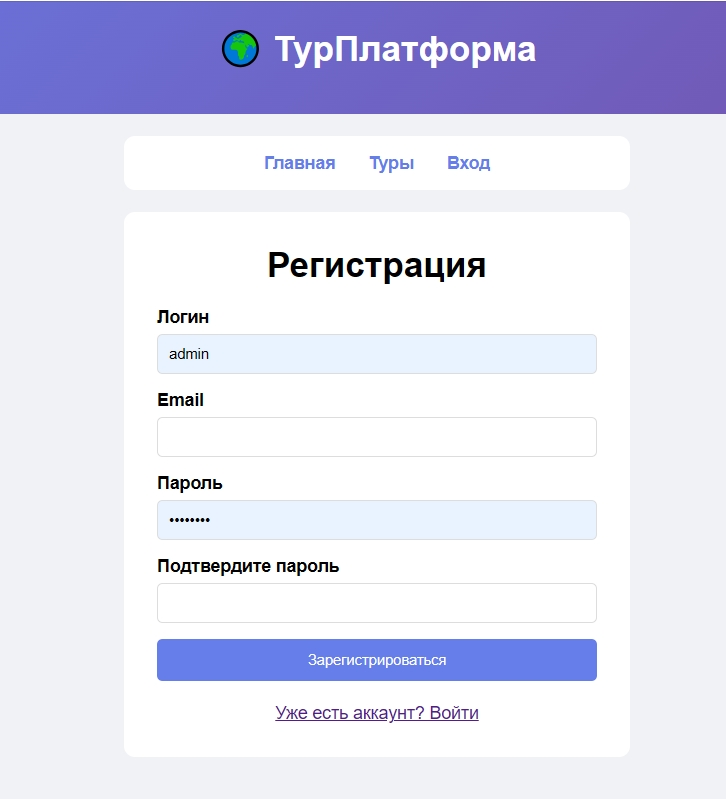
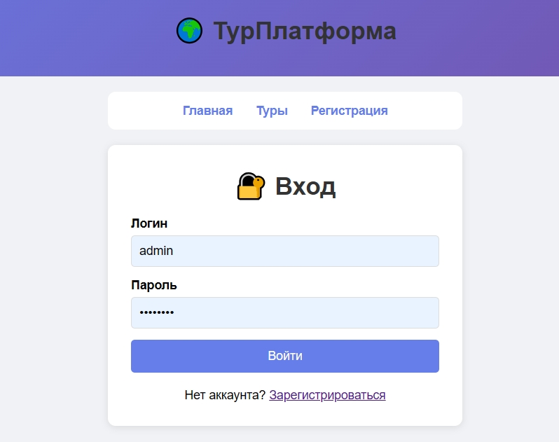
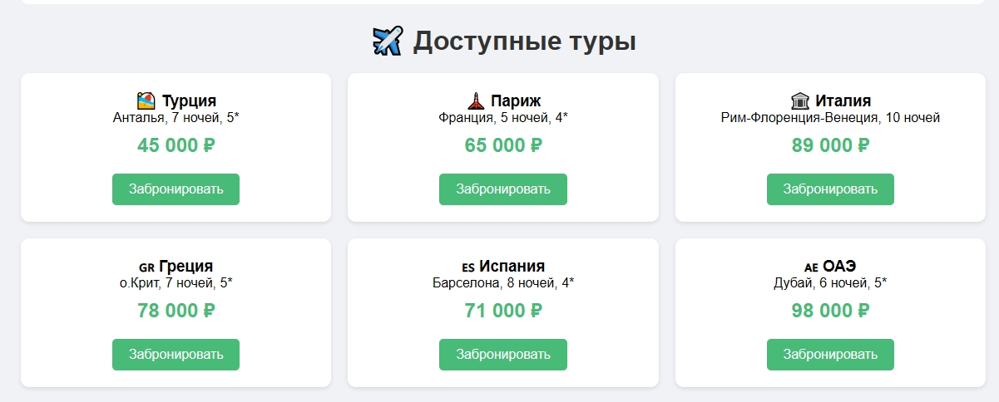
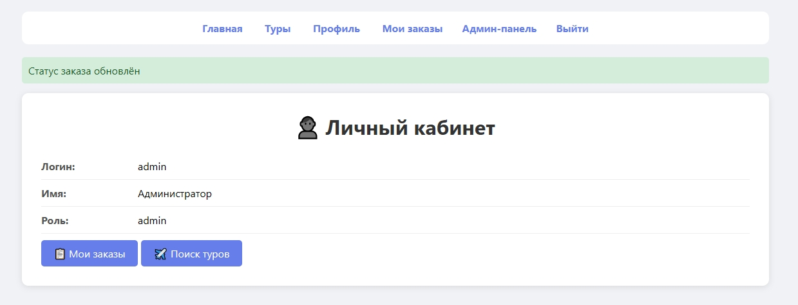
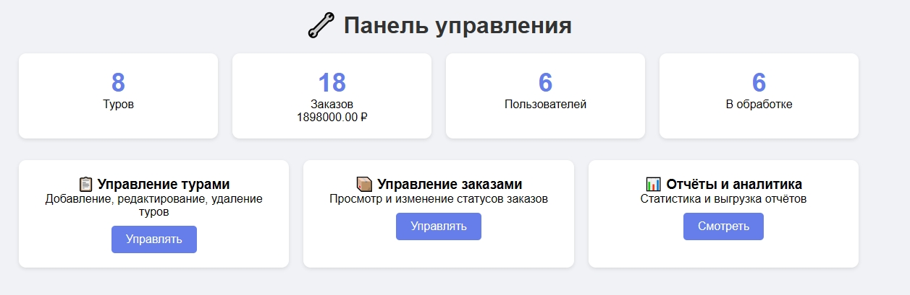

# Руководство пользователя
## Веб-платформа для бронирования и управления турами

---

## 1. Назначение и аудитория

**Назначение:**  
Платформа предназначена для поиска, сравнения, бронирования туров и управления заказами в одном личном кабинете.

**Аудитория:**  
- Путешественники, которые хотят быстро найти и забронировать тур  
- Туристические агентства, которым нужно управлять заказами и турами  

---

## 2. Регистрация и вход

### 2.1. Регистрация нового пользователя

1. Перейдите на страницу `/register`  
2. Заполните поля:
   - **Логин** — придумайте уникальное имя пользователя
   - **Email** — действующий email
   - **Пароль** — не менее 4 символов
   - **Подтверждение пароля** — повторите пароль
3. Нажмите кнопку **«Зарегистрироваться»**

**

> ✅ После успешной регистрации вы будете автоматически авторизованы в системе.

### 2.2. Вход в систему

1. Перейдите на страницу `/login`  
2. Введите **логин или email** и **пароль**  
3. Нажмите кнопку **«Войти»**

**

### 2.3. Выход из системы

Нажмите кнопку **«Выйти»** в верхнем меню на любой странице.

---

## 3. Описание ролей пользователей

| Роль | Описание | Доступные функции |
|------|----------|-------------------|
| **Гость** | Незарегистрированный пользователь | • Просмотр списка туров • Просмотр деталей тура • Регистрация • Вход |
| **Клиент** | Зарегистрированный пользователь | • Всё, что доступно гостю • Личный кабинет • Бронирование туров • Просмотр истории заказов • Отмена бронирования |
| **Администратор** | Привилегированный пользователь | • Всё, что доступно клиенту • Управление турами (добавление, редактирование, удаление) • Управление заказами • Просмотр статистики • Генерация и экспорт отчётов |

---

## 4. Основные сценарии работы

### 4.1. Гость: просмотр туров

1. Откройте главную страницу или перейдите на `/tours`  
2. Просмотрите список доступных туров  
3. Нажмите на тур, чтобы увидеть детальную информацию  
4. Если вы захотите забронировать тур, система предложит вам войти или зарегистрироваться

### 4.2. Клиент: бронирование тура

1. **Войдите** в систему  
2. Перейдите на страницу `/tours`  
3. Выберите интересующий вас тур  
4. Нажмите кнопку **«Забронировать»**  
5. Подтвердите бронирование  

**

После бронирования вы можете отслеживать статус заказа в личном кабинете.

### 4.3. Клиент: просмотр и отмена заказов

1. Войдите в систему  
2. Перейдите в **личный кабинет** (`/profile`)  
3. Вы увидите список ваших заказов  
4. Для отмены заказа нажмите кнопку **«Отменить»** рядом с нужным заказом  

**

> ⚠️ Отменить можно только заказ, который ещё не завершён.

### 4.4. Администратор: управление отчётами

1. Войдите в систему под учётной записью **администратора**  
2. Перейдите в раздел **«Админ-панель»** (`/admin`)  
3. Выберите пункт **«Отчёты»** (`/admin/reports`)  
4. На странице отчётов вы увидите:
   - Статистику по турам, заказам и пользователям
5. Нажмите кнопку:
   - **«Экспорт в Excel»** — для выгрузки отчёта в формате Excel
   - **«Экспорт в Word»** — для выгрузки отчёта в формате Word

**

---

## 5. Часто задаваемые вопросы (FAQ)

### Вопрос 1: Что делать, если я забыл пароль?

**Ответ:** В текущей версии функция восстановления пароля не реализована. Обратитесь к администратору платформы для сброса пароля.

### Вопрос 2: Почему я не могу забронировать тур?

**Ответ:** Возможные причины:
- Вы не авторизованы в системе (гость не может бронировать)
- Недостаточно свободных мест
- Тур уже завершился

### Вопрос 3: Как изменить личные данные (имя, телефон)?

**Ответ:** В текущей версии редактирование профиля доступно только через администратора. Вы можете обратиться к нему для изменения данных.

### Вопрос 4: Как связаться с поддержкой?

**Ответ:** Напишите нам на почту: `tourplatform@example.com`

### Вопрос 5: Какие браузеры поддерживаются?

**Ответ:** Рекомендуем использовать актуальные версии Google Chrome, Firefox, Safari или Edge.

---

## 6. Контакты

- **Репозиторий проекта:**  
  https://github.com/2Dbaca/Web-platform-for-booking-and-managing-tours-
- **Разработчики:**  
   Кучеев Егор — e.kucheev@yandex.ru  
   Гончар Кирилл — Kirillgon.kirill@mail.ru

---

*© 2026 Веб-платформа для бронирования и управления турами*